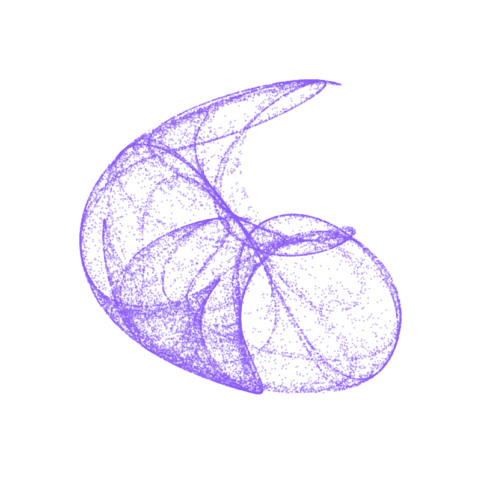

# C++ Workshop

A 2-hour introduction to C++ for programmers familiar with Python.

## What You'll Learn

- How C++ differs from Python (compiled vs interpreted)
- Variables, types, and the build cycle
- Loops and file output
- Working with vectors
- Building a visual project: the De Jong attractor

## The De Jong Attractor

By the end of this workshop, you'll generate mathematical art using C++:

These images are created by iterating simple equations thousands of times and plotting each point.

## Requirements

- A C++ compiler (g++ or clang++)
- A text editor or IDE
- A web browser (to view SVG output)

## Getting Started

We'll complete the exercises using GitHub Codespaces, which provides a ready-to-use development environment in your browser.

1. Click the green **Code** button at the top of this repository
2. Select the **Codespaces** tab
3. Click **Create codespace on main**

Once your Codespace loads, you'll have a full VS Code editor with g++ already installed. Then follow along with the workshop materials.
